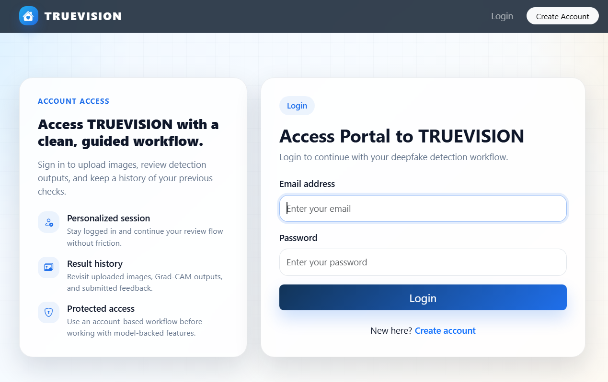
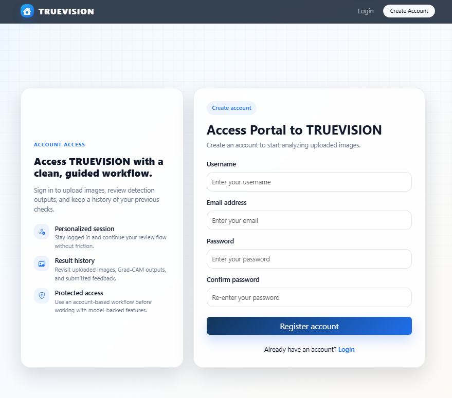
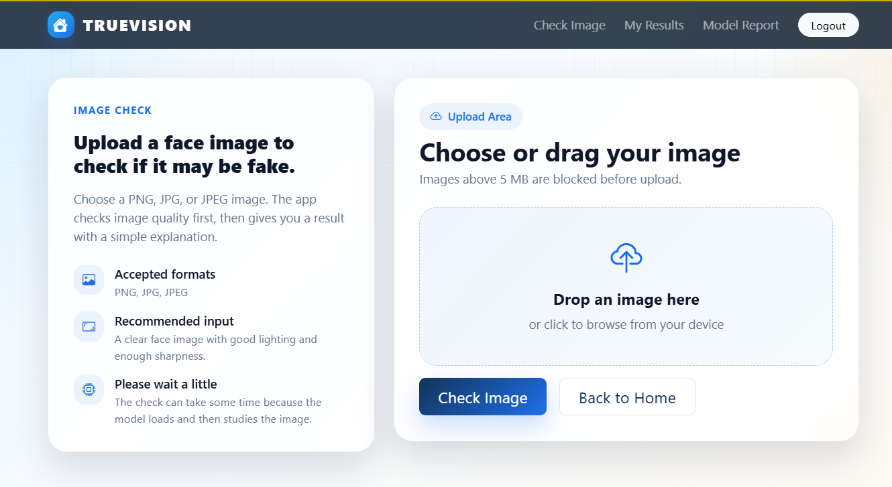
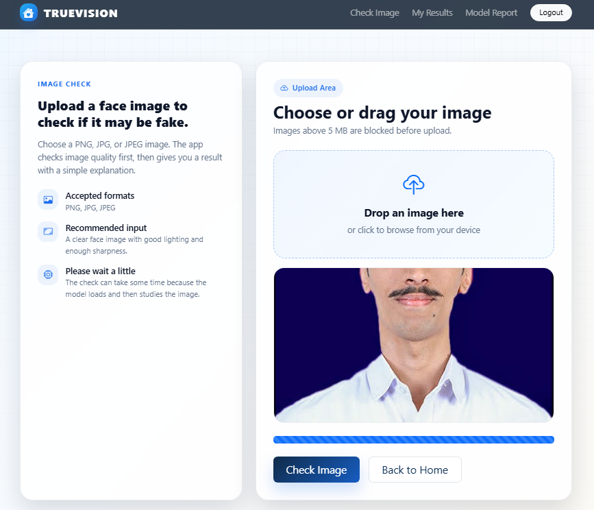
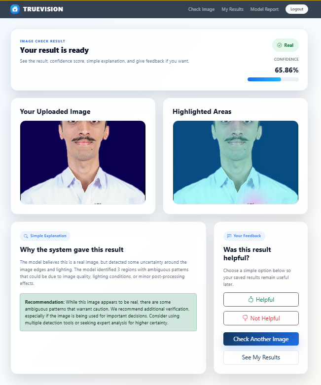

# TRUEVISION: Vision-Based Deepfake Detection System

TRUEVISION blends machine learning and software engineering into a full-stack web app for deepfake detection. It accepts face images, runs a Swin-based model for prediction, and presents confidence plus Grad-CAM explanations in a clean UI.

## Highlights

- ML inference with PyTorch + Swin Transformer
- Explainability with Grad-CAM heatmaps
- Flask web app with authentication and upload history
- Performance dashboard with model comparison
- Modern Bootstrap UI

## Tech Stack

- Backend: Flask, SQLAlchemy, Flask-Login, Flask-Migrate
- ML: PyTorch, Transformers (Swin), OpenCV, MediaPipe
- Explainability: Grad-CAM, Matplotlib
- Frontend: Bootstrap 5

## App Flow

1. Login or register
2. Upload a face image (PNG/JPG/JPEG)
3. View prediction + confidence
4. Inspect Grad-CAM heatmap and explanation
5. Save results and give feedback

## Project Structure

```
app.py
routes.py
models.py
templates/
static/
```

## Setup

### 1. Create a virtual environment

**Windows**

```bash
python -m venv venv
venv\Scripts\activate
```

**macOS/Linux**

```bash
python3 -m venv venv
source venv/bin/activate
```

### 2. Install dependencies

```bash
pip install -r requirements.txt
```

### 3. Configure environment variables

Create a `.env` file:

```
SECRET_KEY=your-secret-key
DATABASE_URL=sqlite:///database.db
```

### 4. Initialize the database

```bash
python manage.py
```

### 5. Run the app

**Windows**

```bash
set FLASK_APP=routes.py
flask run
```

**macOS/Linux**

```bash
export FLASK_APP=routes.py
flask run
```

Open `http://127.0.0.1:5000/` in your browser.

## Model Weights

This project expects:

```
your_model_path.pth
```

If you are publishing to GitHub, keep large `.pth` files out of the repo and use Git LFS or provide a download link.

## Data and Privacy

- Uploaded images are to be stored in `static/uploads/`.
- Grad-CAM outputs are to be stored in `static/gradcam/`.
  Do not upload these folders to public GitHub.

## Performance Report

The model report page compares accuracy, precision, recall, F1 score, and other metrics. It also provides a confusion matrix and a classic comparison table for easier understanding.

## Screenshots
Home  


Login


Register


Upload  


Upload-check


Result  


## Troubleshooting

- First run may take longer because the model loads into memory.
- If the app fails on startup, confirm `DATABASE_URL` and model weights path.

## License

See `LICENSE`.
